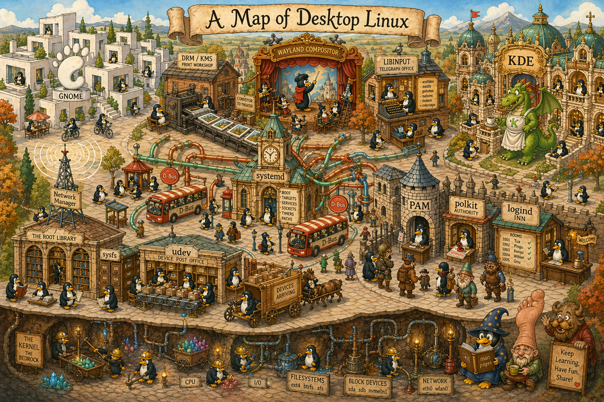

A modern Linux desktop is a working compromise between forty years of Unix tradition, thirty years of X11, twenty years of D-Bus-era coordination, and a decade or so of Wayland's attempt to start fresh. When you press the power button on your laptop and a graphical login screen appears fifteen seconds later, a cast of several dozen independent projects — kernel drivers going back to the 90s, protocols redesigned in 2008, config models introduced in 2011, a display server first sketched in 2012, a session tracker ratified in 2015 — briefly cohere into something that looks, to a user, like one operating system.

This series is a map of that cohering. It's for people who use this system every day and have the vague sense that they don't quite understand how it actually works.

## Who this is for

You've been using desktop Linux for a while. You're comfortable in a terminal. You can install packages, edit config files, write shell scripts, follow a stack trace, read a man page. You've heard — probably typed, probably debugged — things like `systemd`, `udev`, `D-Bus`, `PAM`, `polkit`, `NetworkManager`, `Wayland`, `cgroups`, `sysfs`. You know they exist.

But if someone asked you to explain how they fit together — what actually happens when you plug in a USB drive, why your screenshot tool stopped working when you switched to Wayland, what happens the moment you close your laptop lid, what's going on under the hood when you connect to a new WiFi network — you'd probably wave your hands. You know the pieces. You don't have the picture.

This series is for that gap. It's not an introduction to Linux. It's not a tutorial on any specific tool. It's a systematic walk through the layers of a desktop Linux system, with enough depth at each layer to build a durable mental model — and enough hands-on detail that you can verify everything on your own machine.

The target is the fluent user who wants to become a comfortable systems thinker about the OS they already use.

## The stack has a history, and it matters

Most explanations of Linux pretend the system is timeless: here is how systemd works, here is how Wayland works, treat them as given. This is a lie that makes things harder to learn. Every component in this stack exists as a response to something that came before. Understanding systemd without knowing what SysV init was actually like is memorizing vocabulary; knowing SysV, you see systemd's design decisions as *answers*, not arbitrary rules.

A rough timeline of the pieces you'll meet:

- **1971** — Unix's first edition.[^unix-v1] The file abstraction, processes, pipes, the syscall interface. The bones of the system you're running on are this old.
- **1984** — The X Window System is released at MIT.[^x11] Network-transparent, client-server, designed for an era when clients might be mainframes. It will run Linux desktops essentially unchanged for the next thirty-five years.
- **1991** — Linus posts the first Linux kernel announcement.[^linux-announce] Initial focus: POSIX compatibility and running on his 386.
- **1995** — Sun introduces PAM.[^pam] Every Unix program that authenticates stops reinventing the auth stack.
- **2002** — Havoc Pennington (with Alex Larsson and Anders Carlsson) starts D-Bus at Red Hat.[^dbus] The goal is to stop desktops from inventing per-project IPC mechanisms (CORBA, DCOP, Bonobo).
- **2003-2009** — The kernel's `udev` subsystem replaces the old static `/dev` and `devfs`.[^udev] `sysfs` arrives.[^sysfs] Kernel Mode Setting moves display control out of X and into the kernel.[^kms] Mesa's DRI2 arrives to let clients render directly on GPUs.[^dri2]
- **2008** — Kristian Høgsberg begins Wayland.[^wayland] The premise: the X server's 1984 assumptions don't fit how modern apps want to render, and the code can't evolve any further without a restart.
- **2010** — Lennart Poettering (with Kay Sievers) starts systemd.[^systemd] PID 1 was a neglected frontier; the proposal is to consolidate init, service management, logging, and session tracking into one coherent model.
- **2011-2015** — logind, resolved, networkd, and timesyncd appear as systemd components.[^systemd-components] The classic split between "init" and "everything else" dissolves.
- **2014** — libinput consolidates touchpad/tablet/mouse logic that had lived in a dozen X drivers into a single library that both X and Wayland compositors can use.[^libinput]
- **2016** — GNOME 3 starts defaulting to Wayland on capable hardware.[^gnome-wayland]
- **2019** — io_uring lands in the kernel.[^io-uring] A fresh take on async I/O that reshapes high-performance userspace.
- **2021-2025** — Wayland crosses the threshold: new toolkits target it first, major distros default to it, the remaining X11 holdouts (NVIDIA, screen recorders, input injection tools) slowly come around.

These dates are not trivia. Every one of them corresponds to a decision the stack is still living with. When your Electron app runs under XWayland instead of natively, that's because Electron was built when X was the default and hasn't caught up yet — a 1984 protocol hosting a 2015 app via a 2012-designed translation layer. When your touchpad's palm rejection Just Works across every desktop environment, that's because libinput exists; when it didn't, it didn't. When `systemctl status` shows you a cgroup tree with every process a service has spawned, that's because systemd's designers decided, around 2011, that PID tracking was inadequate and cgroups were the right substrate.

Each generation added a layer that papered over what the previous one couldn't do well. The result is not a clean architecture. It is a layered, historically-sedimented system whose layers mostly cooperate because people have worked hard to make them cooperate. That cooperation is the interesting part.

## The thesis

If there is a single observation this series keeps returning to, it is this:

**Modern Linux is a federation of cooperating daemons, coordinating via well-defined IPC, sitting on top of a kernel that exposes its state through standardized APIs. The interesting questions are at the boundaries: how does PAM hand off to logind? How does udev coordinate with systemd? What does NetworkManager push to systemd-resolved, and how does resolved integrate with the libc resolver? When polkit prompts for a password, whose password is it verifying and through what mechanism? Understanding the seams is more valuable than memorizing any single layer.**

This is different from how Linux often gets taught. The usual approach is either "here's a bag of commands, paste them when you need them" (cookbook) or "let's build a kernel from scratch" (deep dive). Neither helps you understand why `systemctl` prompts you for a password sometimes and not others, or why your Wayland compositor loses access to the GPU when you switch to another TTY.

The through-line here is *composition*. Every layer has a job. Every layer has an interface at its top and bottom. The system works when they compose cleanly; most bugs live at the seams; most of what feels mysterious in Linux becomes legible once you can name the seams.

## What this isn't

- **Not a distro comparison.** Examples are from Fedora Workstation, but concepts apply to any systemd-based Linux with a modern desktop. Where distros differ meaningfully, it'll be called out.
- **Not a server guide.** Focus is desktops and laptops. Servers share most of the kernel and coordination layers but skip the graphical stack and make different assumptions about networking.
- **Not an introduction to programming or systems.** If you've never used a syscall, some sections move fast. You don't need to be a kernel developer — understanding is the goal, not implementation.
- **Not exhaustive.** Audio (PipeWire), containers, bootloaders, filesystems, the kernel's TCP/IP stack — all legitimately important, all largely out of scope. The line being held is: *what does a logged-in user on a desktop need to understand to reason about the running system they're already using?*

## The map

Bottom-up, kernel first.

### Foundations: the kernel's surface

The kernel exposes itself to userspace through a handful of distinct interfaces. Three guides:

1. **[Syscalls](./syscalls.md)** — the classical interface. The families, how to observe them, how they compose into everything userspace does.
2. **[sysfs](./sysfs.md)** — the kernel's structured device and object model, served as a virtual filesystem at `/sys`.
3. **[procfs](./procfs.md)** — process state and legacy kernel state under `/proc`. The foundation for every observability tool you've ever used.

### Devices and hardware

How hardware shows up and who manages it:

4. **[udev](./udev.md)** — the userspace device manager. Naming, permissions, event dispatch.
5. **[DRM/KMS](./drm_kms.md)** — the kernel's graphics subsystem. How GPU access and display configuration are arbitrated, how frames actually get to the screen.
6. **[libinput](./libinput.md)** — the userspace input library. How keyboards, mice, touchpads, touchscreens, and tablets produce meaningful events consistently across every modern desktop.

### Coordination

How userspace services coordinate:

7. **[systemd](./systemd.md)** — PID 1 and the service manager. Units, dependencies, targets, cgroup integration.
8. **[D-Bus](./d_bus.md)** — the RPC bus for local service-to-service and service-to-app communication.

### Identity, authentication, authorization

Who you are, how you prove it, what you're allowed to do:

9. **[PAM](./pam.md)** — the pluggable authentication framework. How login, sudo, ssh, GDM all share auth logic.
10. **[logind](./logind.md)** — session, seat, and user tracking. The glue between login and hardware access.
11. **[polkit](./polkit.md)** — runtime authorization. How unprivileged desktop apps get to do privileged things without going through `sudo`.

### The network

12. **[NetworkManager](./network_manager.md)** — connection management, WiFi, DHCP, DNS integration, firewall zones. Interleaves with firewalld and systemd-resolved.

### The graphical stack

13. **[GUI overview](./gui_overview.md)** — the whole graphical layer from kernel to toolkit: DRM/KMS for display, libinput for input, Wayland vs X11, compositors, toolkits, desktop environments. A map of where everything sits.
14. **[Wayland protocol](./wayland.md)** — the actual protocol between apps and the compositor. How windows get drawn, how input gets delivered, how the security model differs from X11.

### Capstone

15. **[Power button to desktop](./capstone.md)** — a complete trace of a real boot-to-login-to-desktop, naming every layer, showing how they compose. The victory lap.

The order is a suggested reading path, not a prerequisite chain. If you already know a topic, skip it. If you want to dip in on something specific, each piece is readable in isolation — they cross-reference but don't strictly depend on each other.

## Conventions across the series

A few things are consistent through every piece:

- **Why does this thing exist?** Each guide opens with the problem the component was built to solve. Nothing makes sense without that history.
- **The central abstraction in one paragraph.** A single summary you could write on an index card.
- **A vocabulary section.** The nouns. Usually a table or diagram.
- **A worked example, end to end.** Something concrete that exercises most of the layer, walked through step by step.
- **Hands-on commands.** Stuff you can paste and run right now. If reading produces nothing runnable, the guide failed.
- **Gotchas.** The tacit knowledge. What looks right but isn't.
- **How it fits with the neighbors.** Where this layer stops and the next begins.
- **A quick reference card.** For coming back in a month.
- **Where to learn more.** The handful of resources that repay the time.

The density is intentional. These are not blog-post-length. They're closer to chapters — readable in a sitting, structured for reference afterward. You're meant to run commands as you read. The observatory is the point.

## What you'll need

- A Linux machine with a desktop. Any modern distro works; Fedora Workstation is what the examples assume.
- A terminal you're comfortable in.
- `sudo` or root access for the parts that inspect privileged resources.
- Patience for a book's worth of content across fifteen pieces.
- No special software setup. Everything is already installed on a default desktop Linux. That's the point.

## How to read

**Linearly** if this is new and you want the full arc. The order is designed to introduce dependencies before they're invoked.

**Non-linearly** if you're picking up specific topics. Each piece is standalone, with back-references where they help.

**As a reference** after the first read. The quick-reference cards and inter-piece cross-links let the series function as lookup material for future debugging.

However you read, the commands should be typed. Don't just skim the hands-on sections. The value compounds when the abstractions and the runnable invocations are anchored to each other in memory. You already have the machine. Use it.

## A note on how this series came to be

This series was written by Claude (Anthropic's LLM) in a single long conversation with the site's author, then edited for publication. The framing, the sequencing, and the thesis emerged from a specific real problem: the author was in a Google Store trying to migrate a WeChat account to a new phone, and the store's WiFi blocked client-to-client traffic. Could his laptop host a hotspot with client-to-client visibility while still using the upstream WiFi? The answer involved NetworkManager, firewalld, hostapd, udev, nl80211, and a buggy MediaTek driver.

That one question expanded. From networking to sessions to authentication to the graphical stack to the kernel interfaces underneath, until the conversation had covered most of what a person running a modern Linux desktop would benefit from understanding.

The result reflects one AI's mental model of desktop Linux as of early 2026, shaped by a lot of prior exposure to kernel documentation, man pages, mailing list archives, and technical writing — plus the specific questions a curious engineer was asking in real time. The author verified claims, ran commands, corrected mistakes, and made editorial decisions about scope and packaging. The prose, examples, and structure are mostly as Claude wrote them.

Errors are likely in specifics — driver versions, kernel ABIs, distro conventions all shift subtly, and an LLM sometimes gets stale on them. Structural understanding should hold up. The quick-reference sections at the end of each piece, and the pointers to primary documentation, are the safety net.

Treat this like a well-structured starting point for building your own mental model — not as a definitive reference. The goal isn't for you to trust these pages; it's for you to read them, run the commands, and come away with enough grounding to read the real specs yourself.

Fifty years of Unix, thirty of X, twenty of D-Bus, fifteen of systemd, ten of Wayland, and counting. Fifteen pieces, bottom to top. Let's begin.

## References

[^unix-v1]: [*Unix*](https://en.wikipedia.org/wiki/Unix), Wikipedia — Unix 1st Edition was released at Bell Labs in November 1971; the 1st Edition Programmer's Manual is dated November 3, 1971.

[^x11]: [*X Window System*](https://en.wikipedia.org/wiki/X_Window_System), Wikipedia — X originated at MIT in 1984 as a collaboration between Jim Gettys (Project Athena) and Bob Scheifler (MIT LCS); X version 1 was announced by Scheifler on June 19, 1984.

[^linux-announce]: [*History of Linux*](https://en.wikipedia.org/wiki/History_of_Linux), Wikipedia — Linus Torvalds publicly announced the Linux kernel project on August 25, 1991.

[^pam]: [*Pluggable authentication module*](https://en.wikipedia.org/wiki/Pluggable_authentication_module), Wikipedia — PAM was designed by Vipin Samar and Charlie Lai of Sun Microsystems and first proposed in OSF RFC 86.0 (October 1995).

[^dbus]: [*D-Bus*](https://en.wikipedia.org/wiki/D-Bus), Wikipedia — D-Bus was started in 2002 by Havoc Pennington (Red Hat), Alex Larsson (Red Hat), and Anders Carlsson as part of the freedesktop.org project.

[^udev]: [*udev*](https://en.wikipedia.org/wiki/Udev), Wikipedia — udev was created by Greg Kroah-Hartman and Kay Sievers to replace devfs; the first release was in November 2003.

[^sysfs]: [*sysfs*](https://en.wikipedia.org/wiki/Sysfs), Wikipedia — Patrick Mochel authored sysfs; it first appeared in Linux 2.6.0 (December 2003).

[^kms]: [*Mode setting*](https://en.wikipedia.org/wiki/Mode_setting), Wikipedia — Intel GEM was merged in Linux 2.6.28 (December 2008); Kernel Mode Setting for Intel landed in 2.6.29 (March 2009), with Radeon in 2.6.31 (September 2009) and Nouveau in 2.6.33 (December 2009).

[^dri2]: [*Direct Rendering Infrastructure*](https://en.wikipedia.org/wiki/Direct_Rendering_Infrastructure), Wikipedia — DRI2 was proposed at the 2007 X Developers' Summit by Kristian Høgsberg; the first public protocol version shipped in April 2009 and was included in X11R7.5 (October 2009).

[^wayland]: [*Wayland (protocol)*](https://en.wikipedia.org/wiki/Wayland_(protocol)), Wikipedia — Høgsberg began Wayland as a personal project in 2008 while working at Red Hat; the initial repository was created on September 30, 2008.

[^systemd]: [*systemd*](https://en.wikipedia.org/wiki/Systemd), Wikipedia — Lennart Poettering and Kay Sievers began systemd in 2010; Poettering's "Rethinking PID 1" blog post is dated April 30, 2010.

[^systemd-components]: [*systemd*](https://en.wikipedia.org/wiki/Systemd), Wikipedia — systemd-logind arrived in systemd v30 (April 2011); systemd-networkd in v210 (April 2014); systemd-timesyncd in v213 (2014); systemd-resolved around v215 (2014). (systemd-homed did not land until v245 in March 2020 and is covered separately.)

[^libinput]: [&ldquo;libinput repository created&rdquo;](https://lists.freedesktop.org/archives/wayland-devel/2014-January/012934.html), wayland-devel mailing list, January 2014 — Jonas Ådahl announced the initial split of the Weston input code into an independent library; Peter Hutterer led subsequent development.

[^gnome-wayland]: [&ldquo;Fedora 25 Officially Released as the First Major OS to Offer Wayland by Default&rdquo;](https://www.linux.com/news/fedora-25-officially-released-first-major-os-offer-wayland-default/), Linux.com, November 2016 — Fedora 25 Workstation shipped GNOME 3.22 with Wayland as the default session on November 22, 2016.

[^io-uring]: [*io_uring*](https://en.wikipedia.org/wiki/Io_uring), Wikipedia — io_uring was developed by Jens Axboe and merged into Linux 5.1, released May 5, 2019.
